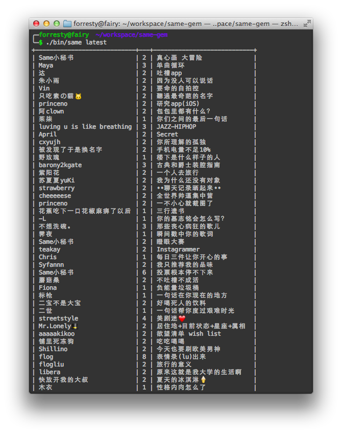

# ttable

[](https://codeclimate.com/github/forresty/ttable)
[](https://coveralls.io/r/forresty/ttable)
[](https://travis-ci.org/forresty/ttable)
[](http://badge.fury.io/rb/ttable)

See it in action:



## Installation

Add this line to your application's Gemfile:

```ruby
gem 'ttable'
```

And then execute:

    $ bundle

Or install it yourself as:

    $ gem install ttable

## Usage

Supports array of array:

```ruby
puts Terminal::Table.new([%w{ hello 1 }, %w{ world 2 }])
=>
+-------+---+
| hello | 1 |
| world | 2 |
+-------+---+
```

Supports hash:

```ruby
puts Terminal::Table.new({ foo: 'bar' })
=>
+-----+
| foo |
+-----+
| bar |
+-----+
```

Support array of hash:

```ruby
puts Terminal::Table.new([{ foo: 'bar1' }, { foo: 'bar2' }])
=>
+------+
| foo  |
+------+
| bar1 |
| bar2 |
+------+
```

Support display of objects responds_to `#to_hash`:

```ruby
class Dummy
  attr_accessor :foo

  def to_hash
    { foo: @foo }
  end
end

puts Terminal::Table.new(Dummy.new.tap { |d| d.foo = 'bar' })
=>
+-----+
| foo |
+-----+
| bar |
+-----+
```

Support :only and :except option:

```ruby
class Dummy2
  attr_accessor :foo1, :foo2, :foo3

  def to_hash
    { foo1: @foo1, foo2: @foo2, foo3: @foo3 }
  end
end

object = Dummy2.new.tap { |d| d.foo1 = 'bar1'; d.foo2 = 'bar2'; d.foo3 = 'bar3' }
puts Terminal::Table.new(object, only: %w{ foo1 foo2 })
=>
+------+------+
| foo1 | foo2 |
+------+------+
| bar1 | bar2 |
+------+------+
```

## Contributing

1. Fork it ( https://github.com/[my-github-username]/ttable/fork )
2. Create your feature branch (`git checkout -b my-new-feature`)
3. Commit your changes (`git commit -am 'Add some feature'`)
4. Push to the branch (`git push origin my-new-feature`)
5. Create a new Pull Request
